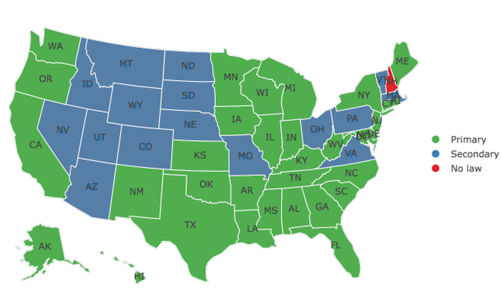
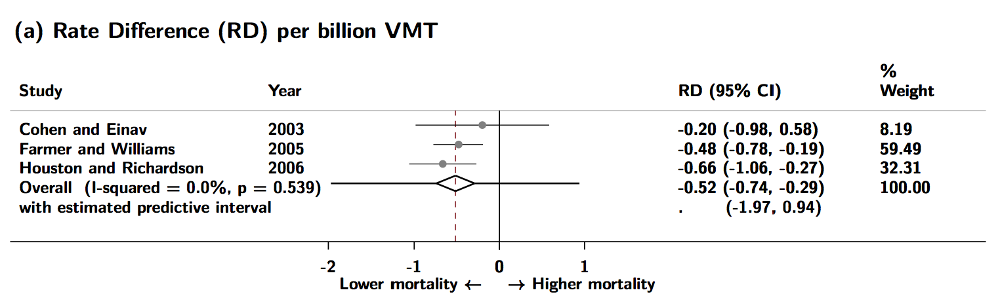
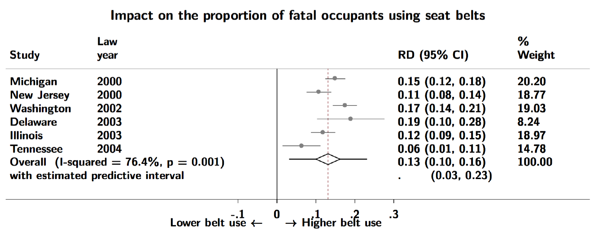

```{r setup, include=FALSE}
options(htmltools.dir.version = FALSE)
library(DiagrammeR)
library(xaringan)
library(leaflet)
library(ggplot2)
library(emo)
library(here)
xfun::pkg_load2(c('tikzDevice', 'magick', 'pdftools'))
```

```{r, include=FALSE}
pdf2png = function(path) {
  # only do the conversion for non-LaTeX output
  if (knitr::is_latex_output()) return(path)
  path2 = xfun::with_ext(path, "png")
  img = magick::image_read_pdf(path)
  magick::image_write(img, path2, format = "png")
  path2
}
```

```{r xaringan-themer, include=FALSE}
library(xaringanthemer)
write_xaringan_theme(text_color = "#000000", header_color = "#737373", text_font_size = "24px",  text_font_family = "'Lucida Sans'", header_font_google = google_font("Source Sans Pro"), title_slide_background_color =  "#ffffff", title_slide_text_color = "#000000", link_color = "#0000ee", footnote_font_size = "0.5em")
```
# CIHR study objectives
## Impact of the combined coal ban and heat pump subsidy on:

---
class: center, top, inverse
# .orange[**2. Design Solutions**]

--
.left[
## .orange[**2.1 Preregistration**]
## .orange[**2.2 Pre-analysis plans**]
## .orange[**2.3 Reporting guidelines**]
]

---

.left-column[
- Important declines in motor vehicle crash deaths.

- US lags behind other countries.
]

.right-column[
```{r, echo=F, out.height="100%", out.width="100%"}
knitr::include_graphics("images/oecd-mvc-trends.png")
```
.footnote[Source: OECD (2018), Road accidents (indicator). doi: 10.1787/2fe1b899-en (Accessed on 21 October 2018)]
]

---
class: center, middle, inverse

# .orange[Should states with secondary enforcement upgrade to primary?]

---
Current laws in existence in 2017


---
background-image: url(images/co-cdot.png)
background-size: cover

.pull-left[
> ### .white["Certainly a proven strategy that other states have adopted, and they are saving lives."]


]

---
### Hang on...

.pull-left[
> CDOT should be concerned with building and maintaining our roads.Not joining the nanny crowd trying to protect us from our own bad decisions.

> Darwinism exists for a reason. If people want to meet their windshields at 60 miles and hour and remove themselves from the gene pool, that might be good for us in the long run.

> It's not a difficult sell to ask people to save their own lives. *But it shouldn't be done at gunpoint*.

]

.pull-right[


]
.footnote[http://www.9news.com, Dec 8, 2016.]  

---
### Potential unintended consequences
.center[

]
.footnote[https://www.aclu.org/report/racial-disparities-florida-safety-belt-law-enforcement]

---
## Rationale for Bayesian evaluation

.pull-left[
-   Prior evidence on primary laws:

    -   Strong evidence they reduce deaths and increase seat belt use;

    -   This evidence is dated (1990s, early 2000s).

-   16 states have upgraded to primary since 2000.
]

--

.pull-right[
Our aims:

1.  Evaluate recent policy changes.*

2.  Combine the evaluation of recent data with prior evidence.

3.  Provide updated evidence on the impact of upgrading to primary
    enforcement.
]

.footnote[*Harper and Strumpf, 2017]

---
## Intuition for Bayesian analysis
Intuition for Bayesian analysis

-   We will generate new empirical evidence on the impact of policy
    changes since 2000.

-   How should we approach inference from this study?

-   Frequentist analysis assumes **zero** background information.

-   Equivalent to belief that primary laws just as likely to:

    -   Decrease death rates by a factor of 100 or 10*;*

    -   *Increase* death rates by a factor 10 or 100.

-   Bayesian inference explicitly incorporates prior information to
    estimate the posterior probability distribution:

$$\underbrace{P(\theta|D)}_{\textrm{posterior probability}}\propto\underbrace{P(D|\theta)}_{\textrm{ likelihood }}\times\underbrace{P(\theta)}_{\textrm{prior probability}}$$
---
### Prior empirical evidence on upgrades to primary enforcement

- 3 high-quality studies on MVC death rates.
- Mean estimate: -0.5 deaths/billion VMT (-0.7, -0.3) $\rightsquigarrow$ .red[1500 deaths/yr].
- Prediction interval for new trial: (-1.97, 0.94). $\rightsquigarrow$ .red[(-6000, +3000).]
-   On relative scale $RR=0.95$, $95\%CI=0.83,1.09$



---
### Prior empirical evidence on upgrades to primary enforcement

- 6 moderate-quality studies on proportion belted
- Average estimate: 0.13 (0.10, 0.16). $\rightsquigarrow$ .red[13 percentage points.]
- Prediction interval for new "trial": (0.03, 0.23).
- On relative scale $RR=1.3$, $95\%CI=1.08,1.58$

.center[

]
.footnote[Hedlund et al. (2008). Estimates from random effects meta-analysis.]

---
### Prior empirical evidence on upgrades to primary enforcement
.footnote[Hedlund et al. (2008). Estimates from random effects meta-analysis.]

.left-column[
- Average estimate: 0.13 (0.10, 0.16). $\rightsquigarrow$ .red[13 percentage points.]

- Prediction interval for new "trial": (0.03, 0.23).

- $RR=1.3$, $95\%CI=1.08,1.58$
]

.right-column[
.center[
6 moderate-quality studies on proportion belted

]]

---
class: center, top, inverse
# .orange[**Outline**]

--
.left[
## .gray[**1  Background**]
## .orange[**2  Methods**]
## .gray[**3  Results**]
]


---
## Semi-Bayesian analysis via data augmentation
.footnote[Greenland (2006, 2007), Sullivan and Greenland (2013)]

.pull-left[
- Data augmentation expresses prior information by adding empirical observations to the observed data.

- Advantages:

    -   Avoids cumbersome full Bayesian machinery (resampling, MCMC).

    -   Approximates the posterior distribution.
]

--

.pull-right[
How to execute:

1.  Define priors.

2.  Encode priors as observations and add to the observed data.

3.  Conduct analysis on all data.

4.  Regression estimate and 95% CI provide approximations to Bayesian
    posterior mean and credible interval.
]
