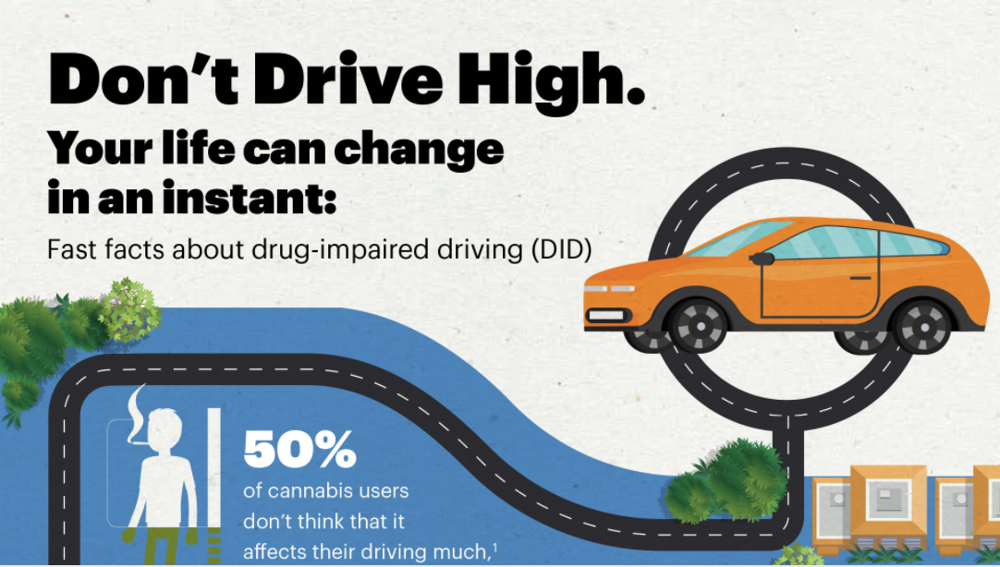
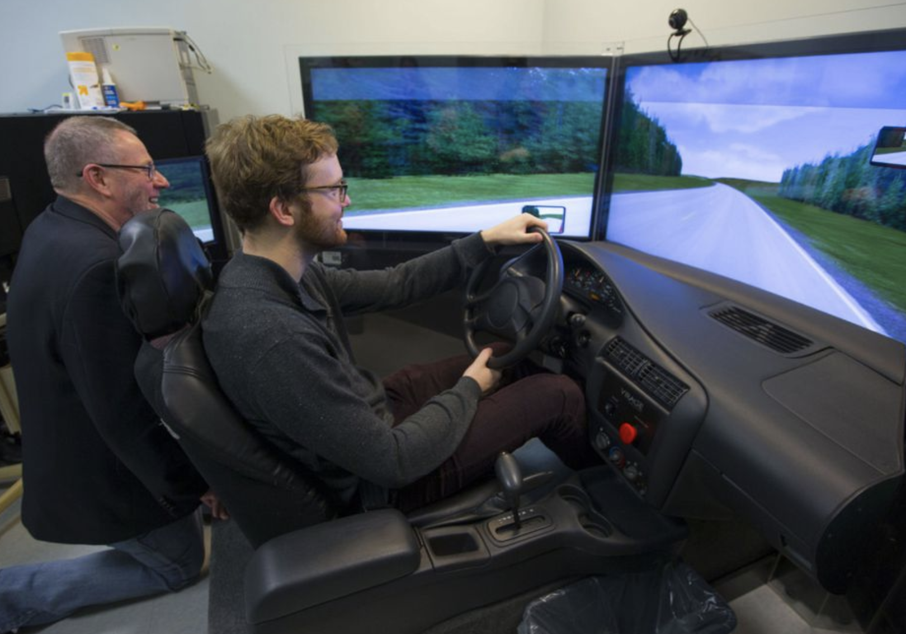

```{r setup, include=FALSE}
options(htmltools.dir.version = FALSE)
library(DiagrammeR)
library(xaringan)
library(leaflet)
library(ggplot2)
library(emo)
library(here)
xfun::pkg_load2(c('tikzDevice', 'magick', 'pdftools'))
```

```{r, include=FALSE}
pdf2png = function(path) {
  # only do the conversion for non-LaTeX output
  if (knitr::is_latex_output()) return(path)
  path2 = xfun::with_ext(path, "png")
  img = magick::image_read_pdf(path)
  magick::image_write(img, path2, format = "png")
  path2
}
```

```{r xaringan-themer, include=FALSE}
library(xaringanthemer)
write_xaringan_theme(text_color = "#000000", header_color = "#737373", text_font_size = "24px",  text_font_family = "'Lucida Sans'", header_font_google = google_font("Source Sans Pro"), title_slide_background_color =  "#ffffff", title_slide_text_color = "#000000", link_color = "#0000ee", footnote_font_size = "0.5em")
```

class: center, top, inverse
# .orange[**Outline**]

.left[
## .orange[**Orientation**]
## .orange[**Background**]
## .orange[**Methods**]
## .orange[**Results**]
## .orange[**Discussion**]
]

---
class: center, top, inverse
# .orange[**Outline**]

.left[
## .orange[**Orientation**]
## .gray[**Background**]
## .gray[**Methods**]
## .gray[**Results**]
## .gray[**Discussion**]
]

---
class: center, middle
# Orientation
## Bayesian framework for inference

---
# Thought experiment
.footnote[See Hamra et al. (2013) for intuitive description of Bayesian inference, which I modified to this example. Image credit: [Government of Canada](https://www.canada.ca/en/services/policing/police/community-safety-policing/impaired-driving/drug-impaired-driving.html)]

.pull-left[
## Suppose you are interested in the effect of exposure to cannabis on the risk of a motor vehicle crash in the next driving trip.
]

.pull-right[

]

---
## Before doing your study: what do you know?

.pull-left[
### Describe your prior beliefs

- Many studies have found excess risks for those consuming cannabis $(X=1)$ compared to those who don't $(X=0)$.

- You think a harmful effect is likely and a protective effect unlikely.

- Based on prior literature, theory, mechanisms, biology, etc.
]

--

.pull-right[
### Quantify your prior beliefs
- Translate your beliefs into probability statements.

- E.g., you're 95% sure that exposure to cannabis increases the risk of a crash between 0% and 40%

- Can be represented by a prior distribution: $N(.20, 0.1)$*
]

.footnote[*Prior mean = average of limits = (0 + .4)/2 = 0.20; prior SD = width of interval divided by width of SD units = (|0 - 0.4| / (2x1.96)) = 0.1.]


---
## Visualizing prior information
.left-column[
- Summary of our prior knowledge about the risk difference.
]
.right-column[
.center[
```{r p1, echo=FALSE, out.width="80%", fig.asp = 0.7}
p1 <- ggplot() + xlim(-0.2, 0.6) + theme_classic() +
  geom_function(fun = dnorm, args = list(mean = 0.2, sd = 0.1),
                colour="#4daf4a", linetype="longdash", size=1.5) +
  ylab("density") + xlab("Risk difference") + 
  theme(axis.text.y=element_blank(), axis.ticks.y=element_blank(),
        axis.text.x=element_text(size=20))
p1
```

]]

---
## Conduct your study: what did you find?

.pull-left[
### Describe your evidence

- Small pilot RCT using a driving simulator (n=100). 

- You find 10/50 crashed when exposed to cannabis $(X=1)$ and 5/50 crashed among those unexposed $(X=0)$

- RD=0.10 with 95%CI: (-0.04, 0.24) and variance of 0.0051
]

.pull-right[

]

.footnote[Image credit: [Toronto Star](https://www.thestar.com/news/gta/2015/11/26/clinical-study-at-camh-tests-how-cannabis-affects-volunteers-driving-skills.html) 2015-11-26.]


---
## Adding the likelihood based on observed data
.left-column[
- Plot of the likelihood based on observed data.

- Note the peak of the blue curve is the maximum likelihood estimate of RD=0.10.
]
.right-column[
.center[
```{r p2, echo=FALSE, out.width="80%", fig.asp = 0.7}
p2 <- p1 + geom_function(fun = dnorm, args = list(mean = 0.1, sd = 0.07),
                colour="#377eb8", size=1.5)
p2
```

]]

---
## Inference: update your beliefs
.footnote[Note: weights are 1/0.01 = 100 and 1/0.0051 = 196, respectively. So posterior mean = [100(0.20) + 196(0.10)]/(100 + 196) = 0.13. Variance = 1/(100 + 196) = 0.0034.]


- Can combine these two pieces of evidence, since both come from normal distributions.
- Inverse-variance weighting to reflect the amount of *information* given by the prior and likelihood.
- Produces a summary estimate.

.center[

]

---
## Combined plot of the posterior distribution
.left-column[
- Product of the prior probability and the information in the likelihood.

- Revised estimate of the probability that cannabis affects crash risk.
]
.right-column[
.center[
```{r p3, echo=FALSE, out.width="80%", fig.asp = 0.7}
p3 <- p2 + geom_function(fun = dnorm, args = list(mean = 0.13, sd = 0.058),
                colour="#e41a1c", linetype="dotted", size=1.5) 
p3
```

]]

---
.left-column[
.footnote[McElreath (2020)]
- Normal prior not necessary

- In general, the posterior $P(H|data)$ is equal to


$\frac{P(data|H)\times P(H)}{P(data)}$

- The posterior is proportional to the product of the prior and the probability of the data.
]
.right-column[
.center[


]]

---
## Interpretation

.pull-left[
### Frequentist inference
- No probability statements about hypothesis of interest.
- p-value gives evidence of compatibility of observed data with the null, given the model and assuming the null hypothesis is true.
- 95%CI: If we took a large number of repeated samples and computed the 95% CI each time, then 95% of these intervals would contain the true parameter. 
]

.pull-right[
### Bayesian inference:
- Direct statements about probability of hypothesis from the posterior distribution.
- Can say 95% probability that parameter is within the limits of the interval.
- Is a learning process and is updated with new information.
- But priors require subjectivity...
]

---
## Summary
.right-column[
### Honest uncertainty
#### Quantitatively incorporating prior knowledge.

### Priors need defending
#### Based on substance. Non-informative are rarely defensible.

### Probability statements
#### More likely what you actually care about.
]

---
class: center, top, inverse
# .orange[**Outline**]

.left[
## .gray[**Orientation**]
## .orange[**Background**]
## .gray[**Methods**]
## .gray[**Results**]
## .gray[**Discussion**]
]


---
class: center, middle
# Background
## Context of seat belts and motor vehicle crash deaths

---
.left-column[
- Important declines in motor vehicle crash deaths.

- Many factors contributing to declines.

- Yet, US lags behind other countries.

- Pace of decline in US has slowed.
]

.right-column[
```{r, echo=F, out.height="100%", out.width="100%"}

```
.footnote[Source: OECD (2018), Road accidents (indicator). doi: 10.1787/2fe1b899-en (Accessed on 21 October 2018)]
]

---
## Flavors of seat belt legislation

.pull-left[
### .orange[**Primary enforcement**]

### Allows law enforcement officers to pull over drivers and ticket them if they are not wearing their seatbelts.
]

--

.pull-right[
### .orange[**Secondary enforcement**]

### Drivers pulled over for a separate violation (speeding, headlight out, etc.) can be ticketed if they are not wearing their seatbelts.
]

---
.footnote[Pew Trusts, Stateline, April 28, 2017. http://bit.ly/2pFTFPp]
.center[

]


---
.footnote[Source: [CDC](https://www.cdc.gov/transportationsafety/calculator/factsheet/seatbelt.html) Retreived 2021-04-09.]
.pull-left[
> ### The [Centers] for Disease Control and Prevention’s systematic review of 13 high-quality studies ([Shults et al., 2004]) found that primary laws increase belt use by about 14 percentage points and reduce occupant fatalities by about 8 percent compared to secondary laws.
]

.pull-right[

]

---
.left-column[
Current laws in existence in 2017
]

.right-column[

.footnote[Source: Insurance Institute for Highway Safety]
]

---
class: center, middle, inverse

# .orange[Should Colorado upgrade to primary?]

---
background-image: url(images/co-cdot.png)
background-size: cover

.pull-left[
> ### .white["Certainly a proven strategy that other states have adopted, and they are saving lives."]


]

---
### Hang on...

.pull-left[
> CDOT should be concerned with building and maintaining our roads. Not joining the nanny crowd trying to protect us from our own bad decisions.

> Darwinism exists for a reason. If people want to meet their windshields at 60 miles and hour and remove themselves from the gene pool, that might be good for us in the long run.

> It's not a difficult sell to ask people to save their own lives. *But it shouldn't be done at gunpoint*.

]

.pull-right[


]
.footnote[http://www.9news.com, Dec 8, 2016.]  

---
### Potential unintended consequences
.center[

]
.footnote[https://www.aclu.org/report/racial-disparities-florida-safety-belt-law-enforcement]

---
## Rationale for Bayesian evaluation

.pull-left[
- Prior evidence on primary laws:
  - Strong evidence they reduce deaths and increase seat belt use;
  - This evidence is dated (1990s, early 2000s).  
  
- 16 states have upgraded to primary since 2000.

- Concerns about unintended consequences.
]

--

.pull-right[
Our aims:

1.  Evaluate recent policy changes.*

2.  Combine the evaluation of recent data with prior evidence.

3.  Provide updated evidence on the impact of upgrading to primary
    enforcement.
]

.footnote[*Harper and Strumpf, 2017]

---
## Intuition for Bayesian analysis

.right-column[
### Purpose
#### We will generate new empirical evidence on the impact of policy changes since 2000.

### Outcomes
#### Deaths per mile traveled and % of deaths wearing seat belts

### Question
#### How should we approach inference from this study?
]

---
## Intuition for Bayesian analysis
.pull-left[
- Frequentist analysis ignores background information.

- Equivalent to belief that primary laws just as likely to:
  - Decrease death rates by a factor of 100 or 10.
  
  - *Increase* death rates by a factor 10 or 100.
  
- .red[This is also a prior.]
]

--

.pull-right[
- Use priors to encode existing information.

- Bayesian inference explicitly incorporates prior information to estimate the posterior probability distribution:

$$\underbrace{P(\theta|D)}_{\textrm{posterior}}\propto\underbrace{P(D|\theta)}_{\textrm{ likelihood }}\times\underbrace{P(\theta)}_{\textrm{prior}}$$
]


---
class: center, middle

# But where do we get our priors?

---
### Prior empirical evidence on upgrades to primary enforcement
.footnote[Estimates from random effects meta-analysis. Context for RD: in 2018 33,654 MVC deaths and 3,240 billion vehicle miles traveled for a rate of 10.4 (NHTSA data)]


--

- Mean estimate: -0.5 deaths/billion VMT (-0.7, -0.3) $\rightsquigarrow$ .red[1500 deaths/yr].
- Prediction interval for new trial: (-1.97, 0.94). $\rightsquigarrow$ .red[(-6000, +3000 deaths/yr).]
- On relative scale $RR=0.95$, $95\%CI=0.83,1.09$


---
### Prior empirical evidence on upgrades to primary enforcement
.footnote[Hedlund et al. (2008). Estimates from random effects meta-analysis.]

.right-column[
.center[
6 moderate-quality studies on proportion belted

]]

--

.left-column[
- Average estimate: 0.13 (0.10, 0.16). $\rightsquigarrow$ .red[13 percentage points.]

- Prediction interval for new "trial": (0.03, 0.23).

- $RR=1.3$, $95\%CI=1.08,1.58$
]


---
class: center, top, inverse
# .orange[**Outline**]

.left[
## .gray[**Orientation**]
## .gray[**Background**]
## .orange[**Methods**]
## .gray[**Results**]
## .gray[**Discussion**]
]

---
class: center, middle
# Methods
## Design and analysis


---
## Semi-Bayesian analysis via data augmentation
.footnote[Greenland (2006, 2007), Sullivan and Greenland (2013)]

.pull-left[
- Data augmentation expresses prior information by adding empirical observations to the observed data.

- Advantages:

    -   Avoids cumbersome full Bayesian machinery (resampling, MCMC).

    -   Approximates the posterior distribution.
]

--

.pull-right[
How to execute:

1.  Define priors.

2.  Encode priors as observations and add to the observed data.

3.  Conduct analysis on all data.

4.  Regression estimate and 95% CI provide approximations to Bayesian
    posterior mean and credible interval.
]

---
## Why *semi-* Bayes and not fully Bayes?
.right-column[
### Focus
#### Only interested in the policy effect, not other parameters.

### Clustered treatment
#### Straightforward with conventional software, harder with fully specified Bayesian framework.

### Convenience
#### Much less computationally intensive.
]

---
## How do we augment the observed data?
.footnote[*Higgins & Spiegelhalter (2000); Greenland (2007,2008). Check these numbers yourself in Stata by typing `csi 4 4 99996 99996`]

- One way to think about priors is as bets on the "true" effect.
- Suppose we were 95% sure the true $RR$ is between (0.25, 4).
- What kind of data would correspond to the prior?*
- Imagine we had a small randomized evaluation of upgrading to primary enforcement:


|        |  Primary  | Secondary  |  Estimates  |
|--------| :-------: | :--------: | -----------------------------|  
|Deaths  |     4     |     4      | $RR_{prior}=1.0$ |  
|Pop     |  100,000  |  100,000   | $95\%CI_{prior}=(0.25,4.0)$ |  
 
- Add these prior data to our observed data as an additional stratum.
- Literally.

---
## Construction of priors
.footnote[*NHTSA, Primary Enforcement Saves Lives (2006); CDC, Motor Vehicle Prioritizing Interventions.]

- Specify prior interval for the $RR$ (effect of law), translated into mean and
    variance.
    
--

3 sets of priors:
1.  **Non-informative**: similar to frequentist assumptions. $\rightsquigarrow N(ln(1),100)$

2.  **Empirical**: prediction interval from prior meta-analysis.
    -   MVC: 95% bet that true $RR$ between 0.83, 1.09 $\rightsquigarrow N(ln(0.95),0.005)$
    -   %belted: 95% bet that true $RR$ between 1.08, 1.58 $\rightsquigarrow N(ln(1.30),0.009)$
    
3.  **Subjective**: from existing policy documents.*
  - Estimate 7-8% reduction on fatalities, 12 to 18 percentage points on seat belt use.
    - We add some additional uncertainty around these estimates.

---
## Summary of prior record construction
.left-column[
- Recall the priors encode **information** that we append to our data.

- Means adding deaths and person-time.
]

.right-column[

]

---
## Data

- Person-level FARS data on fatal crashes and vehicle miles traveled (VMT) from the Fatal Analysis Reporting System (FARS), 2000-2016.

- Dates of primary enforcement upgrades in each state.

- Other time-varying state policies:
  - Speed limits;
  - Graduated driver's license programs;
  - Blood alcohol content laws.

-  Other time-varying state covariates:  
  - Police per capita;
  - Per capita alcohol consumption;
  -  Median income.

---
### Data structure (10 ages x 50 states x 17 years ~ n=8500)


---
### How do we add the prior? (empirical version)
- First define the mean and variance for the prior  
```stata
set obs 1        // only adding 1 record for 1 parameter
gen m = ln(0.95) // mean, i.e., RR=0.95
gen v = 0.005    // variance, equiv to 95%CI 0.83, 1.09
gen s = 25       // scaling factor
```  

--

- Next set a variable representing number of prior cases, based on the variance 
of the prior and the scaling factor to facilitate normality (if using). 
```stata
gen a = round(25^2 / 0.005,0) // num of prior cases
gen c = 0 // set constant to 0 for prior records, 1 for actual data
```

---

- Now set a variable for which prior is constructed to 1 for the covariate of interest, as well as equivalent person-time based on prior. Save as a dataset.
```stata
gen cov = 1 / 25
gen pt = a / exp(-0.95 / 25) // person-time for prior record
save "$cdir/data/derived/priorf2", replace
list
     +-------------------------------------------------------------+
     | prior           m      v    s        a   c   cov         pt |
     |-------------------------------------------------------------|
     |     2   -.0512933   .005   25   125000   0   .04   129841.4 |
     +-------------------------------------------------------------+
```
- Append this prior data to the observed data
```stata
use "$cdir/data/derived/mvc-laws-prior-data.dta", clear
append using "$cdir/data/derived/priorf1"
```
- Analyze the entire dataset using 'standard' methods.
- No Bayesian machinery needed.
---
### Added priors (n=8503, 1 added record for each prior)

---

.footnote[Meyer (1995); Angrist & Pischke (2009); Ryan et al. (2015)]

.left-column[
### Study design: Difference-in-Differences
Use pre/post data on treated and control groups to estimate the effect of policy.
]

.right-column[
.center[

]]

---
.left-column[
- Identification strategy: timing of legislation.

- Assume that conditional on covariates, precise timing of upgrades is "as-if" random.
]

.right-column[
.center[

]]


---
## Likelihood model specifications
.footnote[*speed limit laws, graduated driver's license laws, BAC laws,
    alcohol consumption per capita, police officers per capita, state
    median income, police reported alcohol involved, and proportion of
    crash deaths on rural roads.]

### For MVC death rates
- Poisson model, i.e., $y_{ast}\sim Poisson(\mu_{ast})$:

$$ln(\mu_{ast})=\alpha+{\color{red}\beta\times Primary_{st}}+\boldsymbol{\gamma}\mathbf{A}_{ast}+\boldsymbol{\delta}\mathbf{Z}_{st}+\boldsymbol{\sigma}_{s}+\boldsymbol{\tau}_{t}+ln\left(VMT_{ast}\right)$$

where:
 - ${y}_{ast}$ is deaths for age group *a*, state *s*, and time *t*.
 - $Primary=1$ when a primary enforcement law is in effect
 - $\boldsymbol{\gamma}$, $\delta$, are coefficients for
    age groups $(\mathbf{A}_{ast})$, other time-varying state covariates $(\mathbf{Z}_{st})$ *
 - $\boldsymbol{\sigma}$, and $\mathsf{\boldsymbol{\tau}}$ are state and year fixed effects, respectively.
 - ${VMT}_{ast}$ is vehicle miles traveled (billions)
    

---
## Likelihood model specifications
### For proportion belted
- Grouped logit model:

$$ln\left(p_{ast}/[1-p_{ast}]\right)=\alpha+{\color{red}\beta\times Primary_{st}}+\boldsymbol{\gamma}\mathbf{A}_{ast}+\boldsymbol{\delta}\mathbf{Z}_{st}+\boldsymbol{\sigma}_{s}+\boldsymbol{\tau}_{t}$$
where:
- $p_{ast}$ is the proportion of deaths wearing a seat belt in age group *a* and state *s* at time *t*.
- other coefficients as before.


- SEs clustered by state
- Reporting marginal effects on probability scale

---
class: center, top, inverse
# .orange[**Outline**]

.left[
## .gray[**Orientation**]
## .gray[**Background**]
## .gray[**Methods**]
## .orange[**Results**]
## .gray[**Discussion**]
]


---
## Some descriptive comparisons
.left-column[
- Important differences in covariates across levels of legislation.

- Also likely for unobserved confounders.

- DD approach can help.
]

.right-column[

| Variable | Remained Secondary | Remained Primary | Upgrade to Primary |  
| -------- | :----------------: | :--------------: | :----------------: |  
| *Max speed limit, %*|  |  |  |  
| <70mph| 60.3 | 30.1 | 35.6 |  
| 70mph| 9.3 | 48.2 | 57.2 |  
| >70mph| 30.5 | 21.7 | 7.2 |
| *BAC law, %*|  |  |  |  
| <0.10 | 12.8 | 4.6 | 18.3 |  
| <0.08 | 85.2 | 95.4 | 87.1 |  

]

---
.left-column[Visualization of empirical prior for MVC deaths per billion VMT]
.right-column[

]

---
.left-column[
Visualization of empirical prior for MVC deaths per billion VMT

Add likelihood
]
.right-column[

]

---
.left-column[
Visualization of empirical prior for MVC deaths per billion VMT

Add likelihood

Posterior distribution
]
.right-column[

]

---
.left-column[
Visualization of **subjective** prior for MVC deaths per billion VMT

Add likelihood

Posterior distribution
]
.right-column[

]

---
## Results for MVC deaths


---
## Results for proportion belted


---
Sensitivity analysis with subjective priors (95% CIs)
.center[

]

---
## Fully Bayesian analysis
.footnote[*Rstan model bglm2 results above, 4 chains, each with iter = 2000; warmup = 1000; thin = 1; total post-warmup samples = 4000)]
- Consistent with fully Bayesian estimates
- Clustered standard errors more challenging in full Bayes


---
## Added benefit of full Bayes: estimate anything!

- Creating a full posterior distribution allows lots of flexibility to estimate different quantities of interest (we don't have to be slaves to NHST).
- E.g., what is the probability that the law parameter is < -0.05?

.left-column[
$P(\beta<-0.05 | \theta)=0.04$

or < -0.03?

$P(\beta<-0.03 | \theta)=0.87$

These statements are impossible with frequentist inference.
]

.right-column[
.center[

]]

---
class: center, top, inverse
# .orange[**Outline**]

.left[
## .gray[**Orientation**]
## .gray[**Background**]
## .gray[**Methods**]
## .gray[**Results**]
## .orange[**Discussion**]
]

---
class: center, middle

# Given our empirical priors, model, assumptions, and data, we can revise our inference.

---
## Interpretation: Impact on MVC deaths per billion VMT
.pull-left[
### .black[Before seeing the data:]
#### .white[x]
###  We were 95% certain true effect was in the interval (-1.7, 0.9)
]

.pull-right[
### .black[After seeing the data:]
#### .white[x]
### Now we are 95% certain the true effect is in the interval (-0.89, 0.35).
]

--

#### .white[x]
.center[
### .blue[Our estimate is now closer to the null, but with less uncertainty]
]

---
## Interpretation: Impact on proportion belted
.pull-left[
### .black[Before seeing the data:]
#### .white[x]
###  We were 95% certain true effect was in the interval (0.03, 0.23)
]

.pull-right[
### .black[After seeing the data:]
#### .white[x]
### Now we are 95% certain the true effect is in the interval (0.04, 0.07)
]

--

#### .white[x]
.center[
### .blue[Much more precision, despite weaker effect]
]


---
.left-column[
### Implications
- Rates still declining.

- Other mechanisms?
]

.right-column[

]

---
Some recent evidence for unintended consequences
.center[

]

---
## Conclusions
.right-column[
### Bayesian interpretation
#### Newer evidence suggests weaker impact, despite priors.

### Other mechanisms
#### Continued declines in MVC death rates due to improved road and vehicle technology, traffic calming measures, or other changes.

### Heterogeneity
#### Recent converts to seat belt use (due to law upgrades) may be a subpopulation with different risks.
]

---
### Reproducible materials (including these slides)


---
background-image: url(images/mcgill-university.jpg)
background-size: cover
class: center, middle
#### .white[sam.harper@mcgill.ca]
#### .white[@sbh4th]
    